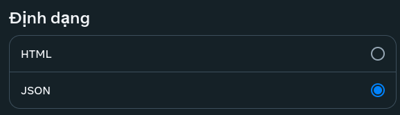

# facebook-voice-extractor

a small tool that i wrote in 2021 to extract voice files from Facebook backup

## setup

1. clone this repo

```sh
git clone https://github.com/shioko0317/facebook-voice-extractor.git
cd facebook-voice-extractor
npm install
```

2. create a backup from your facebook account (https://www.facebook.com/dyi)<br>make sure the backup includes your messages and it'll be downloaded as JSON instead of HTML !




3. put your extracted backup folder (containing the `messages` folder) to this repo folder

4. change the directory on line 2 and user list on line 3 in `facebook.js` to filter the voice sender

5. `npm start` and voila ! the extracted voice files will be in `extracted_voices` folder